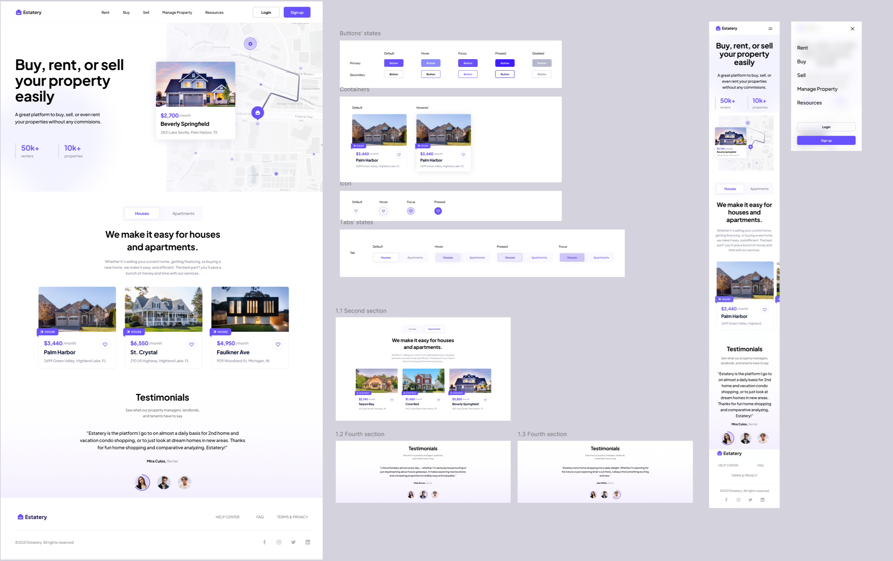

# 🚀 Landing Page Estatery - React + TypeScript + Tailwind CSS + Framer Motion


Responsywny landing page zbudowany z użyciem **React**, **Tailwind CSS** oraz **Framer Motion**. Projekt został zaprojektowany na podstawie landing page o dynamicznym interfejsie oraz pełnej responsywności na wszystkich urządzeniach.

## ✨ Technologie

- ⚛️ React – komponentowa architektura
- 🟦 TypeScript – statyczne typowanie i lepsze wsparcie dla IDE
- 💨 Tailwind CSS – szybkie i elastyczne stylowanie
- 🎞️ Framer Motion – animacje i przejścia
- 📱 RWD – w pełni responsywny layout

## 🌐 Wersja Live

Strona dostępna online dzięki [Vercel](https://vercel.com):

🔗 [Zobacz na żywo](https://landing-page-estatery-oljq.vercel.app/)

## 🔧 Instalacja i uruchomienie lokalne

Aby uruchomić projekt lokalnie:

1. **Sklonuj repozytorium:**

   ```bash
   git clone https://github.com/Jakubba/landing-page-estatery.git
   cd landing-page
   ```

2. **Zainstaluj zależności:**

   ```bash
   npm install
   ```

3. **Uruchom projekt:**

   ```bash
   npm run dev
   ```

4. **Otwórz w przeglądarce:**

   Przejdź do `http://localhost:5173`

## 📁 Struktura projektu

```
landing-page-estatery/
├── public/
├── src/
│   ├── assets/                  # Obrazy i ikony 
│   │   ├── icons 
│   │   ├── images 
│   │   └── main.jsx
│   ├── components/              # Komponenty UI
│   │   ├── AniamtedText/
│   │   │   ├── AniamtedText.tsx
│   │   │   └── AniamtedText.types.ts
│   │   ├── AuthButtons/
│   │   │   └── AuthButtons.tsx
│   │   ├── Avatar/
│   │   │   ├── Avatar.tsx
│   │   │   ├── Avatar.tsx
│   │   │   └── Avatar.types.ts
│   │   ├── Button/
│   │   │   ├── Button.tsx
│   │   │   └── Button.types.ts
│   │   ├──Card/
│   │   │   ├── Card.scss
│   │   │   ├── Card.tsx
│   │   │   └── Card.types.ts
│   │   ├── Footer/
│   │   │   └── Footer.tsx
│   │   ├── FooterBoottom/
│   │   │   └── FooterBoottom.tsx
│   │   ├── FooterNav/
│   │   │   ├── FooterNav.tsx
│   │   │   └── FooterNav.types.ts
│   │   ├── FooterSocialMedia/
│   │   │   ├── FooterSocialMedia.tsx
│   │   │   └── FooterSocialMedia.types.ts
│   │   ├── HamburgerMenu/
│   │   │   ├── HamburgerMenu.tsx
│   │   │   └── HamburgerMenu.types.ts
│   │   ├── HeartButton/
│   │   │   └── HeartButton.tsx
│   │   ├── Hero/
│   │   │   ├── Hero.tsx
│   │   │   └── Hero.types.ts
│   │   ├── LisitngSwiper/
│   │   │   ├── LisitngSwiper.tsx
│   │   │   └── LisitngSwiper.types.ts
│   │   ├── Logo/
│   │   │   ├── Logo.tsx
│   │   │   └── Logo.types.ts
│   │   ├── MapBlock/
│   │   │   └── LMapBlock.tsx
│   │   ├── Menu/
│   │   │   └── Menu.tsx
│   │   ├── Navbar/
│   │   │   ├── Navbar.tsx
│   │   │   └── Navbar.types.ts
│   │   ├── StatItem/
│   │   │   ├── StatItem.tsx
│   │   │   └── StatItem.types.ts
│   │   ├── TabButton/
│   │   │   ├── TabButton.tsx
│   │   │   └── TabButton.types.ts
│   │   ├── TabSelector/
│   │   │   ├── TabSelector.tsx
│   │   │   └── TabSelector.types.ts
│   │   ├── TagLabel/
│   │   │   ├── TagLabel.scss
│   │   │   ├── TagLabel.tsx
│   │   │   └── TagLabel.types.ts
│   │   ├── Testimonal/
│   │   │   ├── Testimonal.tsx
│   │   │   └── Testimonal.types.ts
│   │   ├── TestomonialsSection/
│   │   │   ├── TestomonialsSection.tsx
│   │   │   └── TestomonialsSection.types.ts
│   │   └──TextBlock/
│   │       └── TextBlock.tsx
│   ├── data/                  # Dane statyczne do komponentów
│   │   ├── footerData.ts 
│   │   ├── heroData.ts 
│   │   ├── lisitngData.ts
│   │   ├── navbarData.ts 
│   │   ├── tabSelectorContent.ts 
│   │   └── TestimonalsData.ts
│   ├── hooks/
│   │   └── useScrollAnimation.ts  
│   ├── styles/                  # Style globalne   
│   │   └── base/
│   │       ├── font.scss 
│   │       ├── global.scss 
│   │       └── swiper.scss
│   ├── utils/
│   │   └── aniamtions.ts 
│   ├── App.scss
│   ├── App.jsx
│   ├── index.css
│   ├── main.tsx
│   └── main.jsx
├── .gitignore
├── .prettiercc
├── index.html
├── eslint.config.js
├── package-lock.json
├── package.json
├── tailwind.config.js
├── package.json
└── README.md
```

## 👤 Autor

Projekt stworzony przez **Jakub Barszcz**

## 📝 Licencja

Projekt dostępny na licencji [MIT](LICENSE).

```

---

```
